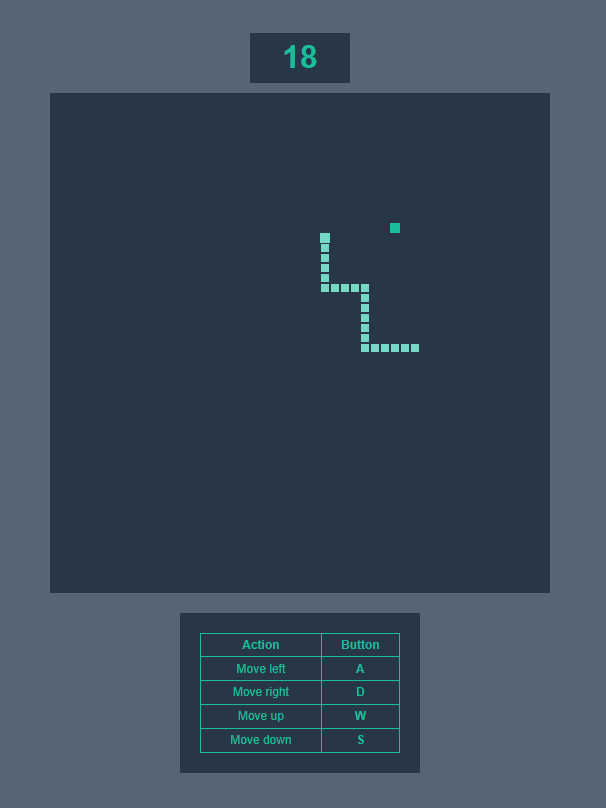

# Snake Game 

Attempt to implement the world popular game [Snake](https://en.wikipedia.org/wiki/Snake_(video_game_genre)) web version.

---

---

##### Control buttons:
- **Left**: `press` **A**  
- **Right**: `press` **D**  
- **Up**: `press` **W**  
- **Down**: `press` **S**

##### Build and run:
To run the game in a docker container, execute [run.sh](run.sh) the file, and open in browser at [localhost:80](http://localhost:80)
